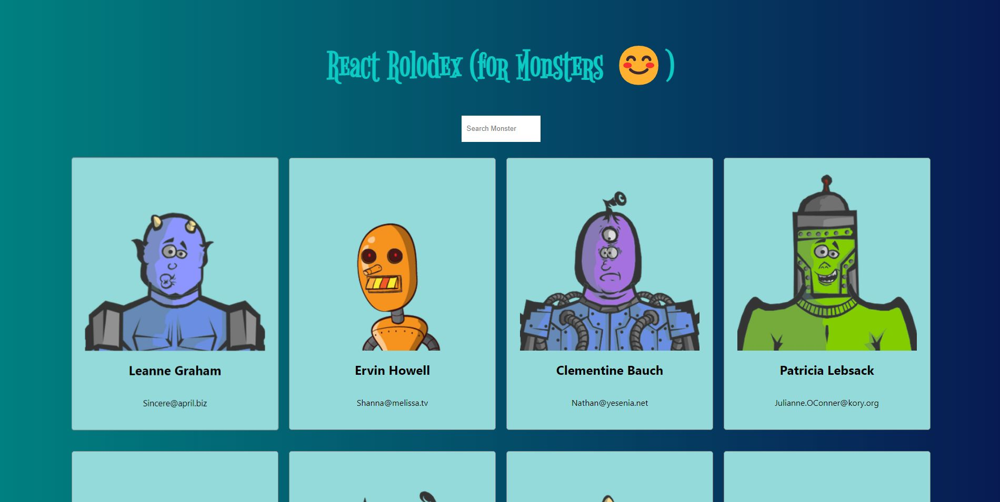
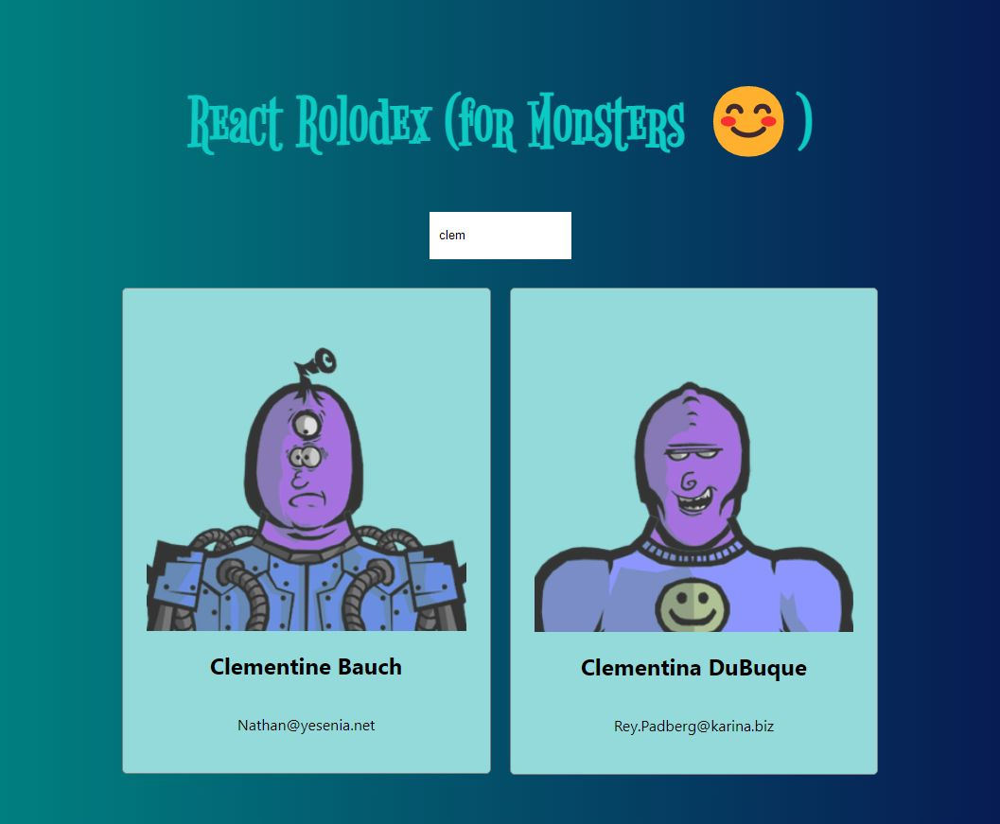

# React-Rolodex

Link to the live web application => (https://react-rolodex-4b206.web.app/) \
A simple react app based on database (for monsters).\
It displays user details (who are of course monsters) and provides search function for them.\
It has 2 variants:\ 
1. Class Components\ 
2. Functional Components

## Here's how it looks-like

## How to Run the project on your Device

First step is install latest version of Node on your device.\
Get any one of the variants by selecting the branch and download it (both have similar output).\
In the project directory, you can run:

### `npm install`

Runs the node pakage manager (npm) and installs the dependencies of the project.

### `npm audit fix` (optional but recommended)

Runs the node pakage manager (npm) and fixes any issue with modules.

### `npm start`

Runs the app in the development mode.\
Open [http://localhost:3000](http://localhost:3000) to view it in your browser.\

The page will reload when you make changes.
